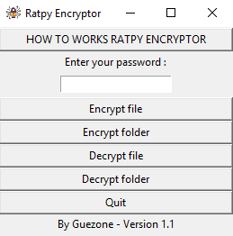
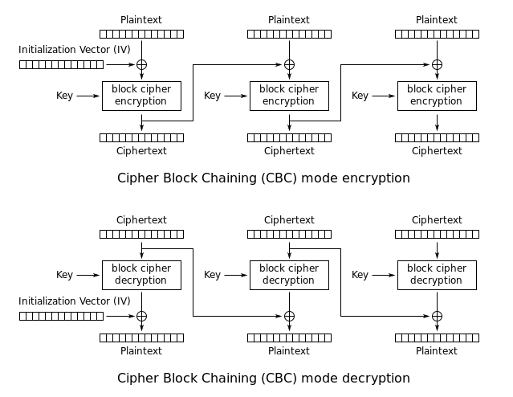

# RatpyEncryptor

File and folder encryption software, in full GUI.
## Usage

Ratpy Encryptor allows the encryption of files but also of files by means of a password. Before starting, I advise you to choose a password "strong" (greater than or equal to 12 characters, at least an upper case, a lower case, a number and a special character)

Each action (encryption / decryption) for each type (file / folder) is defined on a button. The software graphically prompts you to choose a file / folder.

> The folder encryption function scans all files, directories recursively and encrypts each file.

Once encrypted, files are written with a ".enc" extension. They are obviously unusable. Once decrypted, the file (s) resume their initial extension as well as their readable content.

## Requirements 
Ratpy Encryptor uses the Python "os" and "webbrowser" libraries. You will need to install the following libraries beforehand:
- Tkinter
- PyAesCrypt

You can use pip to install these libraries :
> pip install tk

> pip install pyaescrypt

You can also download the executable versions in the Download section below.

## How to work ?
Symmetric encryption is used in this program, and more specifically the AES algorithm.

The library precisely uses the AES-CBC method with 256-bit keys. Here is a diagram of this method:

Your password is used to generate the AES symmetric encryption key. It is then coupled to a random IV (initialization vector). This couple makes it possible to encrypt a block of data with a XOR operation.

## Download 
You can download the executable versions of the utility on these two links :

[Windows executable](https://1drv.ms/u/s!Av29I-NvEXBP3TniLuIArnE7URtq?e=2B78G0)

[Mac OS X - to come up](to%20come%20up)

> The executable is not signed, browsers may detect a threat.

## Contact-me
-   Join the chat : https://discord.gg/bFwPjV6
-   Send me an e-mail :  [custodio.aubin@outlook.com](mailto:guezpics@gmail.com)
